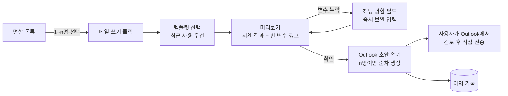
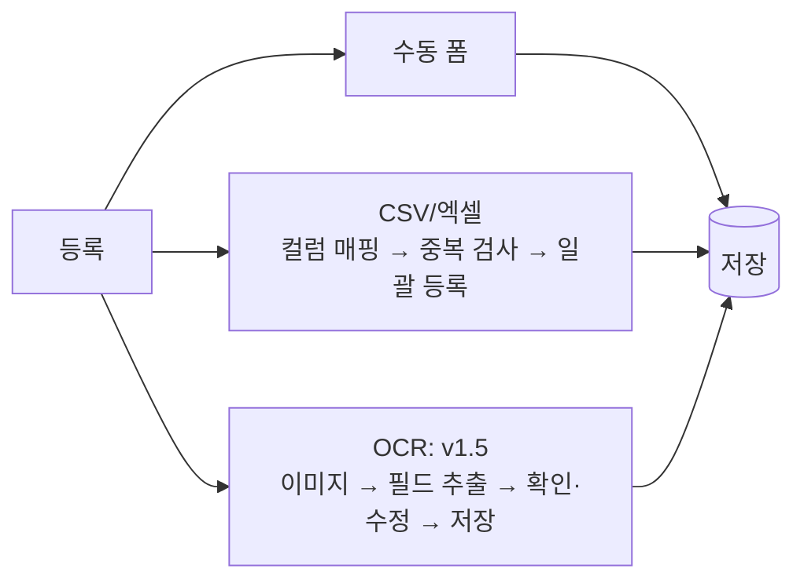
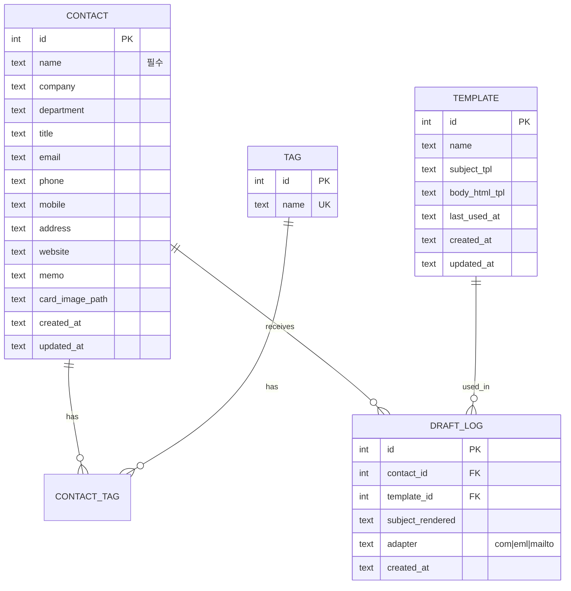
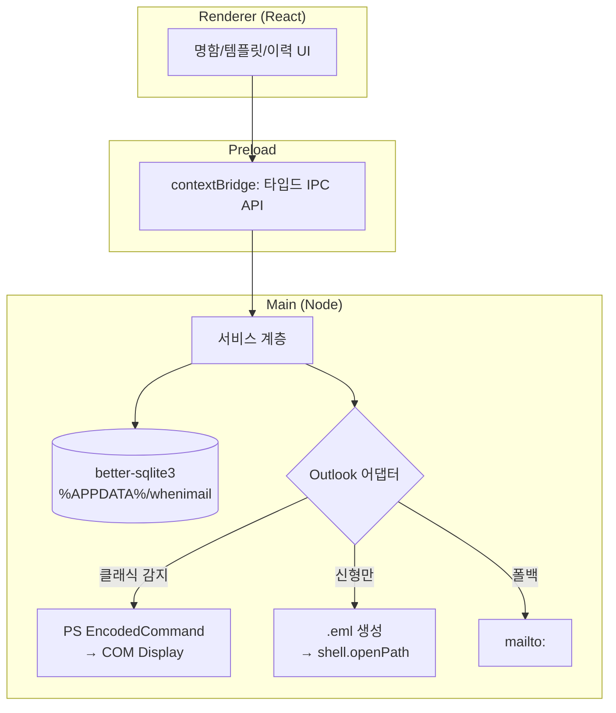

# whenimail — 명함 기반 이메일 발송 데스크톱 앱 설계

- 버전: v1.0 (2026-09-01)
- 상태: draft
- 작성 근거: 사용자 인터뷰(2026-09-01 결정 4건) + Outlook 연동 기술 검증

---

## 1. 배경 · 목적

명함으로 받은 연락처에 인사·제안 메일을 보낼 때마다 ① 명함에서 정보를 옮겨 적고 ② 과거에 쓴 메일을 찾아 복사하고 ③ 이름/회사만 바꿔 보내는 반복 작업이 발생한다. 이 과정에서 **이름·회사를 잘못 바꿔 보내는 사고**가 가장 큰 리스크다.

**목적(우선순위순)**
1. 명함 정보 → 템플릿 치환 → Outlook 초안까지를 클릭 몇 번으로 단축 (작성 시간 절감)
2. 치환 결과를 보내기 전에 눈으로 확인 (오발송 방지 — 자동 전송이 아닌 **초안 열기**를 택한 이유)
3. 명함·템플릿·발송 이력을 한곳에 축적 (검색 가능한 개인 자산화)

## 2. 페르소나 → 요구 환원

| 페르소나 특성 | 도출되는 요구 |
|---|---|
| 영업/대외 업무로 명함을 자주 받는 직장인 1인 | 로컬 저장, 서버·계정 불필요, 설치 즉시 사용 |
| 회사 메일이 Outlook (Microsoft 365) | Outlook과의 연동은 필수, 별도 SMTP 설정 없음 |
| 상대가 고객이라 오발송에 민감 | 전송 전 초안 확인이 기본 동선. "즉시 전송" 없음 |
| 명함이 종이로 쌓여 있음 | OCR 등록(후순위), 그 전까지 수동 폼 + CSV 일괄 등록 |
| 같은 유형의 메일을 반복 발송 | 템플릿 + 치환 변수, 최근 사용 템플릿 우선 노출 |

## 3. 스코프

**v1 포함**
- 명함(연락처) CRUD, 태그, 검색 — 로컬 SQLite
- 명함 이미지 첨부 보관(원본 파일 저장)
- 이메일 템플릿 CRUD — 제목/본문(HTML) + 치환 변수
- 명함 선택 → 템플릿 적용 → 미리보기 → **Outlook 새 메일 초안 열기**
- 여러 명 선택 시 1인당 초안 1개씩 순차 생성(개별 확인 후 전송)
- 초안 생성 이력 기록
- CSV/엑셀 가져오기

**v1 제외 (근거)**
- 자동 전송/예약 전송 — 초안 확인이 목적과 상충. Graph API 전환 시 재검토
- 팀 공유/동기화 — 개인용 결정. 서버 계층 전체가 불필요
- 수신 확인(오픈 트래킹) — 초안 방식에선 기술적으로 불가
- OCR — v1.5로 분리(엔진 선정 오픈이슈 #2)

## 4. 벤치마크

| 제품 | 장점 → 적용 | 단점 → 개선 |
|---|---|---|
| 리멤버 | 명함 필드 구조(회사/부서/직함 분리)가 검증됨 → 데이터 모델에 채용 | 메일 발송 연동 없음, 클라우드 강제 → 로컬+발송 루프가 본 앱의 차별점 |
| Word 편지 병합 + Outlook | 대량 치환 발송 가능 | 개별 초안 확인 불가, 매번 데이터 파일 연결 → 명함 DB 상주 + 건별 초안으로 개선 |
| Outlook 빠른 문서 요소/서명 | 반복 문구 재사용 | 수신자 정보 치환 없음 → 변수 치환이 핵심 기능 |

## 5. 핵심 기술 결정 (근거 + 폐기안)

### D-1. 전송 방식: Outlook 초안 열기 ✅ (사용자 결정)
- 폐기: Graph API 자동 전송(Azure 앱 등록·관리자 동의 부담, 오발송 리스크), COM 자동 전송(신형 Outlook 미지원)

### D-2. 초안 열기 구현: **어댑터 계층 + 2단 전략**
기술 검증 결과, 단일 방법으로는 신/구 Outlook을 모두 커버할 수 없다:
- **신형 Outlook은 COM/VBA/MAPI를 지원하지 않음** (WebView2 기반, Microsoft 공식 확인)
- `.eml + X-Unsent: 1` 초안 열기는 신형 Outlook에서 **불안정** — HTML 본문일 때 첨부 누락, 헤더 미인식 사례 다수. CRLF→LF 변환·Message-ID 부여로 완화되나 보장 없음

| 우선순위 | 방법 | 조건 | HTML 본문 |
|---|---|---|---|
| 1 | **COM `MailItem.Display()`** — PowerShell `-EncodedCommand`로 실행 | 클래식 Outlook 설치 시 | ✅ 완전 지원 |
| 2 | **`.eml`(X-Unsent: 1, LF 라인엔딩) 생성 → `shell.openPath()`** | 신형 Outlook만 있을 때 | ⚠️ 불안정 (오픈이슈 #1) |
| 3 | `mailto:` 링크 | 최후 폴백 | ❌ 텍스트만 |

앱 시작 시 레지스트리로 클래식 Outlook 설치 여부를 감지해 사용할 어댑터를 정하고, 설정 화면에 현재 모드를 표시한다.

> PowerShell 실행 시 스크립트 파일(.ps1)을 만들지 않고 `-EncodedCommand`(UTF-16LE Base64)로 넘긴다 — 한글 인코딩(cp949) 문제를 원천 차단.

### D-3. 스택: Electron + React ✅ (사용자 결정)
- Electron + React + TypeScript + Vite / DB: `better-sqlite3` (main 프로세스 전용, preload IPC로 노출) / 패키징: `electron-builder`
- 폐기: Tauri(COM 연동을 Rust로 작성해야 함), .NET(사용자 웹 스택 선호)

### D-4. 저장: 로컬 SQLite 단일 파일 ✅ (사용자 결정)
- DB 파일과 명함 이미지는 `%APPDATA%/whenimail/` 아래. 설정에서 폴더 열기·백업(zip 내보내기) 제공

## 6. 정보구조 (IA)

단일 축(작업 대상) 분류, 최대 2뎁스.

```
whenimail
├─ 명함        ── 목록(검색·태그 필터) / 상세·편집 / 가져오기(CSV)
├─ 템플릿      ── 목록 / 편집기(변수 삽입·미리보기)
├─ 이력        ── 초안 생성 기록(누구에게·어떤 템플릿·언제)
└─ 설정        ── Outlook 연동 모드 표시 / 데이터 폴더 / 백업
```

"메일 보내기"는 별도 메뉴가 아니라 **명함 목록/상세에서 시작하는 액션**이다(사용자가 보던 컨텍스트를 잃지 않도록).

## 7. UX 플로우

### 핵심 루프: 명함 → 초안


### 명함 등록


예외 처리:
- 이메일 없는 명함 선택 시 → 선택 단계에서 배지로 표시, 초안 생성 대상에서 제외 경고
- 치환 변수에 값이 없으면 → 미리보기에서 노란 하이라이트 + 기본값(`{{이름|고객님}}`) 적용 여부 표시
- Outlook 미설치/실행 실패 → 어댑터 폴백 시도 후, 최종 실패 시 본문 클립보드 복사 제안

## 8. 데이터 모델



- 중복 판정 기준: `email` 동일 → 같은 사람으로 간주(가져오기 시 병합/건너뛰기 선택)
- 삭제는 soft delete 없이 실삭제 + 이력에는 스냅샷 문자열 유지(`subject_rendered`)

## 9. 템플릿 치환 스펙

- 문법: `{{필드}}`, 기본값 `{{필드|대체값}}` — 예: `{{이름|고객}}님, {{회사|귀사}}의 {{직함|담당자}}님께`
- 지원 변수: 이름, 회사, 부서, 직함, 이메일, 전화, 휴대폰, 주소, 웹사이트, 메모 + `보내는날짜`
- 제목·본문 모두 치환 대상. 본문은 리치 텍스트 에디터(HTML 저장), 에디터 툴바에 "변수 삽입" 버튼
- 치환 엔진은 정규식 단순 치환(외부 템플릿 라이브러리 불필요 수준). 알 수 없는 변수는 치환하지 않고 미리보기에서 경고

## 10. 시스템 아키텍처



- 렌더러에서 Node 직접 접근 금지(`contextIsolation: true`), 모든 파일/DB/프로세스 작업은 main에서
- CSV 파싱은 main에서(`xlsx` 또는 `papaparse`), 매핑 UI는 렌더러

## 11. 마일스톤 — 단계별 주 액션 교체

| 단계 | 사용자가 완수하는 액션 | 포함 |
|---|---|---|
| **M1 핵심 루프** | "명함 1장 등록 → 템플릿으로 Outlook 초안 열기"가 끝까지 됨 | 수동 폼, 템플릿 CRUD, 치환+미리보기, COM 어댑터 |
| **M2 물량 처리** | "기존 연락처 30명을 부어 넣고 5명에게 연속 초안 생성" | CSV 가져오기, 다중 선택 순차 초안, 이력, .eml 폴백 |
| **M3 편의·등록 자동화** | "명함 사진을 던지면 등록됨" | OCR(엔진은 오픈이슈 #2), 백업/복원, 태그 고도화 |

## 12. KPI (개인 생산성 지표)

| 목표 | 지표 | 데이터원 |
|---|---|---|
| 작성 시간 절감 | 초안 1건 생성 소요(선택→초안 열기) | 앱 내 타이머 로그 |
| 실제 사용 정착 | 주간 초안 생성 건수 | DRAFT_LOG |
| 데이터 자산화 | 등록 명함 수 추이 | CONTACT count |

## 13. 오픈이슈

| # | 이슈 | 상태 |
|---|---|---|
| 1 | 신형 Outlook 단독 환경에서 HTML 초안 품질 — .eml 방식 실기기 검증 필요. 실패 시 텍스트 본문으로 강등할지, Graph API drafts를 옵션으로 추가할지 | M2 전 검증 |
| 2 | ~~OCR 엔진~~ → **Tesseract(tesseract.js, 로컬 WASM)로 확정** (2026-09-01, 사용자 결정). 정확도 한계는 폼 확인·수정 단계로 보완, 추후 클라우드 OCR 옵션 추가 여지 | 해결 |
| 3 | 명함 이미지에서 앞/뒷면 2장 관리 여부 | M3 |
| 4 | ~~프로젝트/제품명 확정~~ → **whenimail**로 확정 (2026-09-01) | 해결 |

## 개정 이력
- v1.0 (2026-09-01): 최초 작성. 전송 방식·입력 방식·저장 방식·스택 결정 반영
- v1.1 (2026-09-01): 제품명 whenimail 확정, GitHub 레포 생성(when630/whenimail)
